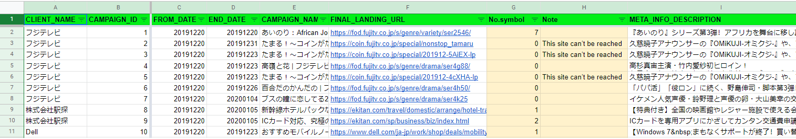
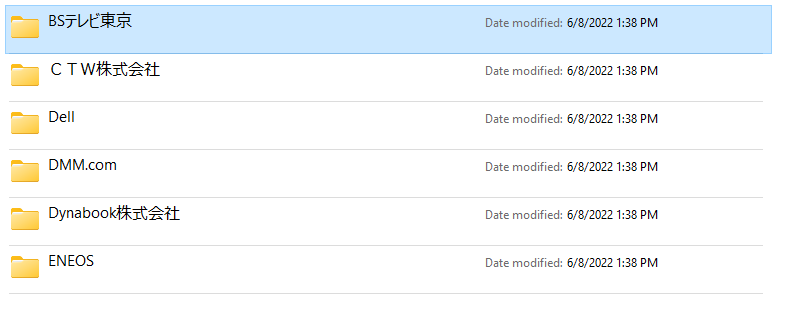
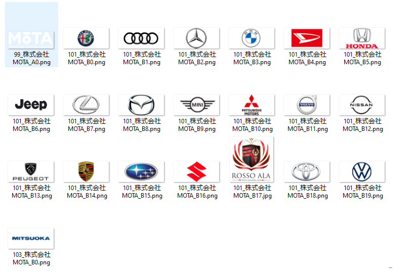
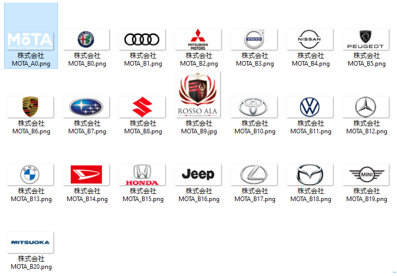

# **DOCS FOR RENAME AND CREATE META DATA STEP**

## 1. ***Remane step***
### * **Requirements**:
***
Định dạng lại tên folders và tên files theo yêu cầu từ phía bên Nhật, cụ thể như sau:
* Tên folders: {CLIENT_NAME}
* Tên files: {CLIENT_NAME}_{Ai|Bi}.{Extension} (i là số thứ tự của ảnh, A B đã có sẵn từ input)

Thông tin được lấy từ file csv bên Nhật gửi về, ví dụ: 

### * **Input**:
***
Input là các folder và các file ảnh sau khi chạy qua A-hashing và lọc check trùng lặp.

Ví dụ input:

### * **Output**:
***
Output theo như yêu cầu phía trên

Ví dụ output:

### * **To-do**:
***
1. Cần xóa bỏ phần {CAMPAIGN_ID} phía đầu của mỗi ảnh, tuy nhiên cần phải lưu trữ lại phần này vì cần dùng cho phần Create Meta data ở phía sau.
2. Sau khi xóa phần đầu, sẽ có những ảnh trùng nhau hoàn toàn về tên(ví dụ ảnh thứ 2 và ảnh cuối cùng trong input) -> đánh lại số thứ tự ảnh để tránh trùng lặp. (tức đánh lại tham số i trong phần yêu cầu)

### * **Code Running**:
***
* Chạy duy nhất 1 file code "rename.ipynb"
* Sử dụng jupyter notebook hoặc Google colabs
* Chuẩn bị sẵn input, chỉnh sửa lại đường dẫn input theo local từng máy
* Sau khi chạy code, output sẽ có 2 phần:
1. Folder ảnh theo đúng yêu cầu như phía trên
2. File "cam_note_id.txt": là file lưu lại {CAMPAIGN_ID} của từng ảnh, mapping từng ID theo từng ảnh, phục vụ việc Create Meta Data. 

*Lưu ý:* File "cam_note_id.txt" được để dưới dạng append, mỗi 1 lần chạy code sẽ ghi thêm vào file thay vì ghi đè, vì vậy nếu chạy test nhiều lần thì lưu ý xóa file cũ.

## 2. ***Create Meta data step***
### * **Requirements**:
***

Tạo ra 1 sheet tổng hợp thông tin về những Landing page mình đã crawl.
Bao gồm các thông tin sau:
1. CLIENT_NAME
2. CAMPAIGN_ID
3. FINAL_LANDING_URL
4. SYMBOL NAME
5. PATH_TO_SYMBOL
6. META_INFO_DESCRIPTION

Ví dụ về
[Metadata](https://docs.google.com/spreadsheets/d/1KXOEXr7EzIyscvyMJMKd6mSuJNq549HGHP6RbJM97Z4/edit#gid=565667894)

### * **Input**:
***

Input gồm:
* 1 file csv là danh sách tất cả Landing page(bên Nhật gửi), chọn lọc ra các trường như phía trên.
* file "cam_note_id.txt" từ output của quá trình Rename trên.

### * **Output**:
***

Như link phía trên: [Metadata](https://docs.google.com/spreadsheets/d/1KXOEXr7EzIyscvyMJMKd6mSuJNq549HGHP6RbJM97Z4/edit#gid=565667894)

### * **To-do**:
***

1. Đọc các file csv vào dataframe
2. Mapping các Landing page theo các ảnh symbol đã crawl theo trường {CAMPAIGN_ID}
3. Merge và tạo ra file Metadata

### * **Code Running**:
***
* Chạy duy nhất 1 file code "MetaData.ipynb"
* Sử dụng Google Colabs
* Chuẩn bị sẵn input trên Google Drive, bao gồm file csv Landing page và file "cam_note_id.txt"
* Chỉnh sửa link đến Drive
* Sau khi chạy code, file Metadata sẽ được lưu vào vị trí chỉ định theo link Drive trong Code.

*Lưu ý:* Có thể sử dụng Jupyter notebook và môi trường lưu trữ các file trên máy local, tuy nhiên do vấn đề bản quyền của Microsoft nên không edit offline trên máy được, sử dụng google drive để tối ưu hóa thao tác.

